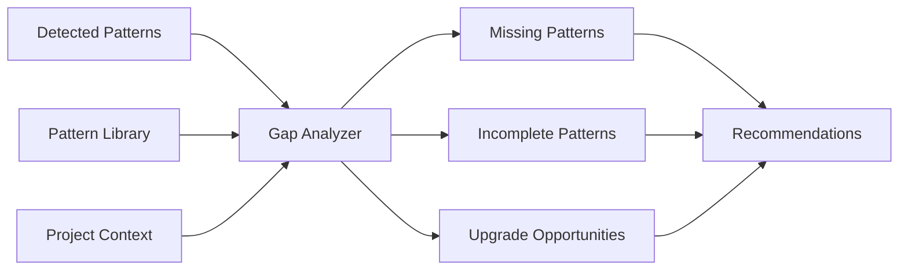

# Gap Analysis Engine

## Purpose

The Gap Analysis Engine compares detected patterns against the complete Contextwarts pattern library to identify missing implementations, incomplete patterns, and improvement opportunities. It generates prioritized recommendations for pattern application.

## Analysis Framework

### Gap Detection Strategy



### Implementation

```javascript
// scripts/gap-analysis.js
const fs = require('fs');
const path = require('path');
const yaml = require('js-yaml');

class GapAnalysisEngine {
    constructor(projectRoot) {
        this.projectRoot = projectRoot;
        this.patternLibrary = new Map();
        this.detectedPatterns = new Map();
        this.gaps = {
            missing: [],
            incomplete: [],
            upgrades: [],
            conflicts: []
        };
    }
    
    async analyzeGaps(detectedPatterns, projectContext = {}) {
        console.log('🔍 Analyzing pattern gaps...');
        
        this.detectedPatterns = new Map(detectedPatterns.patterns.map(p => [p.id, p]));
        
        // Load pattern library
        await this.loadPatternLibrary();
        
        // Analyze different types of gaps
        await this.identifyMissingPatterns(projectContext);
        await this.identifyIncompletePatterns();
        await this.identifyUpgradeOpportunities();
        await this.identifyConflicts();
        
        return this.generateGapReport();
    }
    
    async loadPatternLibrary() {
        const patternsDir = path.join(__dirname, '..', 'patterns');
        const categories = ['technology', 'architecture', 'security', 'infrastructure', 'methodology'];
        
        for (const category of categories) {
            const categoryPath = path.join(patternsDir, category);
            if (!fs.existsSync(categoryPath)) continue;
            
            const patternDirs = fs.readdirSync(categoryPath).filter(d => 
                fs.statSync(path.join(categoryPath, d)).isDirectory()
            );
            
            for (const patternDir of patternDirs) {
                const dependenciesPath = path.join(categoryPath, patternDir, 'dependencies.yaml');
                if (fs.existsSync(dependenciesPath)) {
                    const patternData = yaml.load(fs.readFileSync(dependenciesPath, 'utf8'));
                    this.patternLibrary.set(patternData.name, {
                        ...patternData,
                        category,
                        path: path.join(categoryPath, patternDir)
                    });
                }
            }
        }
        
        console.log(`📚 Loaded ${this.patternLibrary.size} patterns from library`);
    }
    
    async identifyMissingPatterns(projectContext) {
        const missingPatterns = [];
        
        for (const [patternId, pattern] of this.patternLibrary) {
            // Skip if pattern is already detected
            if (this.detectedPatterns.has(patternId)) continue;
            
            // Check if pattern is relevant for this project
            const relevance = this.calculatePatternRelevance(pattern, projectContext);
            
            if (relevance.score > 0.3) {
                missingPatterns.push({
                    pattern: pattern,
                    relevance: relevance.score,
                    reasoning: relevance.reasoning,
                    priority: this.calculatePriority(pattern, relevance, projectContext),
                    effort: this.estimateImplementationEffort(pattern),
                    prerequisites: this.checkPrerequisites(pattern)
                });
            }
        }
        
        // Sort by priority and relevance
        missingPatterns.sort((a, b) => (b.priority * b.relevance) - (a.priority * a.relevance));
        
        this.gaps.missing = missingPatterns;
    }
    
    calculatePatternRelevance(pattern, projectContext) {
        let score = 0;
        const reasoning = [];
        
        // Technology-based relevance
        if (pattern.category === 'technology') {
            score += this.calculateTechnologyRelevance(pattern, reasoning);
        }
        
        // Architecture-based relevance
        if (pattern.category === 'architecture') {
            score += this.calculateArchitectureRelevance(pattern, projectContext, reasoning);
        }
        
        // Security-based relevance
        if (pattern.category === 'security') {
            score += this.calculateSecurityRelevance(pattern, projectContext, reasoning);
        }
        
        // Infrastructure-based relevance
        if (pattern.category === 'infrastructure') {
            score += this.calculateInfrastructureRelevance(pattern, reasoning);
        }
        
        // Methodology-based relevance
        if (pattern.category === 'methodology') {
            score += this.calculateMethodologyRelevance(pattern, projectContext, reasoning);
        }
        
        return { score: Math.min(score, 1.0), reasoning };
    }
    
    calculateTechnologyRelevance(pattern, reasoning) {
        let score = 0;
        
        // Check if pattern complements existing technologies
        const detectedTechIds = Array.from(this.detectedPatterns.keys());
        
        switch (pattern.name) {
            case 'progressive-web-app':
                if (detectedTechIds.includes('modern-web-stack')) {
                    score += 0.7;
                    reasoning.push('PWA enhances existing web application');
                }
                break;
                
            case 'graphql-api':
                if (detectedTechIds.includes('rest-api-pattern')) {
                    score += 0.5;
                    reasoning.push('GraphQL can enhance existing API');
                }
                break;
                
            case 'server-side-rendering':
                if (detectedTechIds.includes('modern-web-stack')) {
                    score += 0.6;
                    reasoning.push('SSR improves SEO and performance');
                }
                break;
        }
        
        return score;
    }
    
    calculateSecurityRelevance(pattern, projectContext, reasoning) {
        let score = 0;
        
        // Security patterns are generally high priority
        const baseSecurityScore = 0.4;
        
        switch (pattern.name) {
            case 'advanced-authentication':
                if (this.detectedPatterns.has('basic-authentication')) {
                    score += 0.8;
                    reasoning.push('Upgrade from basic to advanced authentication');
                } else if (this.hasUserManagement()) {
                    score += 0.9;
                    reasoning.push('User management detected, authentication needed');
                }
                break;
                
            case 'https-security':
                if (!this.detectedPatterns.has('https-security')) {
                    score += 0.9;
                    reasoning.push('HTTPS is essential for web applications');
                }
                break;
                
            case 'api-rate-limiting':
                if (this.detectedPatterns.has('rest-api-pattern')) {
                    score += 0.7;
                    reasoning.push('Public APIs should have rate limiting');
                }
                break;
                
            case 'zero-trust-security':
                if (projectContext.securityRequirements === 'high') {
                    score += 0.8;
                    reasoning.push('High security requirements detected');
                }
                break;
        }
        
        return Math.max(score, baseSecurityScore);
    }
    
    calculateArchitectureRelevance(pattern, projectContext, reasoning) {
        let score = 0;
        
        switch (pattern.name) {
            case 'microservices-architecture':
                if (this.detectedPatterns.has('monolith-first') && 
                    (projectContext.expectedScale === 'high' || projectContext.teamSize === 'large')) {
                    score += 0.6;
                    reasoning.push('Monolith detected with high scale/large team');
                }
                break;
                
            case 'event-driven-architecture':
                if (this.detectedPatterns.has('microservices-architecture')) {
                    score += 0.5;
                    reasoning.push('Event-driven patterns complement microservices');
                }
                break;
                
            case 'cqrs-pattern':
                if (this.hasComplexDataOperations()) {
                    score += 0.4;
                    reasoning.push('Complex data operations detected');
                }
                break;
        }
        
        return score;
    }
    
    calculateInfrastructureRelevance(pattern, reasoning) {
        let score = 0;
        
        switch (pattern.name) {
            case 'container-first-deployment':
                if (!this.detectedPatterns.has('container-first-deployment')) {
                    score += 0.7;
                    reasoning.push('Containerization improves deployment consistency');
                }
                break;
                
            case 'reverse-proxy-load-balancer':
                if (this.detectedPatterns.has('microservices-architecture') ||
                    this.detectedPatterns.has('container-first-deployment')) {
                    score += 0.6;
                    reasoning.push('Load balancing needed for distributed systems');
                }
                break;
                
            case 'enterprise-monitoring':
                if (this.detectedPatterns.has('microservices-architecture') ||
                    this.detectedPatterns.has('container-first-deployment')) {
                    score += 0.8;
                    reasoning.push('Monitoring essential for complex deployments');
                }
                break;
        }
        
        return score;
    }
    
    calculateMethodologyRelevance(pattern, projectContext, reasoning) {
        let score = 0;
        
        switch (pattern.name) {
            case 'test-driven-development':
                if (!this.detectedPatterns.has('test-driven-development')) {
                    score += 0.6;
                    reasoning.push('TDD improves code quality and maintainability');
                }
                break;
                
            case 'development-quality-automation':
                if (!this.detectedPatterns.has('development-quality-automation')) {
                    score += 0.7;
                    reasoning.push('Quality automation essential for team development');
                }
                break;
                
            case 'behavior-driven-development':
                if (projectContext.stakeholderInvolvement === 'high') {
                    score += 0.5;
                    reasoning.push('BDD useful for high stakeholder involvement');
                }
                break;
        }
        
        return score;
    }
    
    calculatePriority(pattern, relevance, projectContext) {
        let priority = relevance.score;
        
        // Security patterns get priority boost
        if (pattern.category === 'security') {
            priority *= 1.5;
        }
        
        // Infrastructure patterns for production readiness
        if (pattern.category === 'infrastructure' && projectContext.stage === 'production') {
            priority *= 1.3;
        }
        
        // Methodology patterns for team development
        if (pattern.category === 'methodology' && projectContext.teamSize !== 'individual') {
            priority *= 1.2;
        }
        
        return Math.min(priority, 1.0);
    }
    
    estimateImplementationEffort(pattern) {
        // Return effort estimate based on pattern complexity
        const effortMap = {
            'progressive-web-app': { hours: 8, complexity: 'medium' },
            'advanced-authentication': { hours: 16, complexity: 'high' },
            'microservices-architecture': { hours: 40, complexity: 'very-high' },
            'container-first-deployment': { hours: 12, complexity: 'medium' },
            'test-driven-development': { hours: 6, complexity: 'low' },
            'development-quality-automation': { hours: 4, complexity: 'low' }
        };
        
        return effortMap[pattern.name] || { hours: 8, complexity: 'medium' };
    }
    
    checkPrerequisites(pattern) {
        const prerequisites = [];
        const missingPrereqs = [];
        
        if (pattern.dependencies?.required) {
            for (const dep of pattern.dependencies.required) {
                prerequisites.push(dep);
                if (!this.detectedPatterns.has(dep)) {
                    missingPrereqs.push(dep);
                }
            }
        }
        
        return {
            total: prerequisites,
            missing: missingPrereqs,
            satisfied: prerequisites.length - missingPrereqs.length
        };
    }
    
    async identifyIncompletePatterns() {
        const incompletePatterns = [];
        
        for (const [patternId, detectedPattern] of this.detectedPatterns) {
            if (detectedPattern.completeness < 0.8) {
                const libraryPattern = this.patternLibrary.get(patternId);
                if (libraryPattern) {
                    incompletePatterns.push({
                        pattern: libraryPattern,
                        current_completeness: detectedPattern.completeness,
                        missing_components: this.identifyMissingComponents(detectedPattern, libraryPattern),
                        improvement_priority: this.calculateImprovementPriority(detectedPattern),
                        completion_effort: this.estimateCompletionEffort(detectedPattern, libraryPattern)
                    });
                }
            }
        }
        
        this.gaps.incomplete = incompletePatterns.sort((a, b) => 
            b.improvement_priority - a.improvement_priority
        );
    }
    
    identifyMissingComponents(detectedPattern, libraryPattern) {
        // This would analyze the pattern definition to identify missing components
        const missing = [];
        
        // Example logic for specific patterns
        if (libraryPattern.name === 'progressive-web-app') {
            const requiredComponents = ['service-worker', 'manifest', 'offline-functionality', 'push-notifications'];
            const presentComponents = detectedPattern.components || [];
            
            for (const component of requiredComponents) {
                if (!presentComponents.some(c => c.toLowerCase().includes(component.replace('-', ' ')))) {
                    missing.push({
                        component,
                        description: this.getComponentDescription(component),
                        priority: this.getComponentPriority(component)
                    });
                }
            }
        }
        
        return missing;
    }
    
    async identifyUpgradeOpportunities() {
        const upgradeOpportunities = [];
        
        // Look for patterns that can be upgraded to more advanced versions
        const upgradeMap = {
            'basic-authentication': 'advanced-authentication',
            'monolith-first': 'microservices-architecture',
            'basic-security': 'enterprise-security',
            'simple-deployment': 'container-first-deployment'
        };
        
        for (const [currentPattern, upgradePattern] of Object.entries(upgradeMap)) {
            if (this.detectedPatterns.has(currentPattern) && 
                !this.detectedPatterns.has(upgradePattern)) {
                
                const libraryPattern = this.patternLibrary.get(upgradePattern);
                if (libraryPattern) {
                    upgradeOpportunities.push({
                        from: currentPattern,
                        to: upgradePattern,
                        pattern: libraryPattern,
                        benefits: this.calculateUpgradeBenefits(currentPattern, upgradePattern),
                        effort: this.estimateUpgradeEffort(currentPattern, upgradePattern),
                        compatibility: this.checkUpgradeCompatibility(currentPattern, upgradePattern)
                    });
                }
            }
        }
        
        this.gaps.upgrades = upgradeOpportunities;
    }
    
    await identifyConflicts() {
        const conflicts = [];
        
        // Check for conflicting patterns in recommendations
        const allRecommendations = [
            ...this.gaps.missing,
            ...this.gaps.upgrades.map(u => ({ pattern: u.pattern }))
        ];
        
        for (let i = 0; i < allRecommendations.length; i++) {
            for (let j = i + 1; j < allRecommendations.length; j++) {
                const pattern1 = allRecommendations[i].pattern;
                const pattern2 = allRecommendations[j].pattern;
                
                const conflict = this.checkPatternConflict(pattern1, pattern2);
                if (conflict) {
                    conflicts.push({
                        pattern1: pattern1.name,
                        pattern2: pattern2.name,
                        conflict_type: conflict.type,
                        description: conflict.description,
                        resolution: conflict.resolution
                    });
                }
            }
        }
        
        this.gaps.conflicts = conflicts;
    }
    
    checkPatternConflict(pattern1, pattern2) {
        // Check pattern conflicts based on their definitions
        if (pattern1.conflicts && pattern1.conflicts.includes(pattern2.name)) {
            return {
                type: 'direct',
                description: `${pattern1.name} directly conflicts with ${pattern2.name}`,
                resolution: 'Choose one pattern based on project requirements'
            };
        }
        
        // Architecture conflicts
        if (pattern1.name === 'monolith-first' && pattern2.name === 'microservices-architecture') {
            return {
                type: 'architectural',
                description: 'Cannot implement both monolith and microservices simultaneously',
                resolution: 'Start with monolith-first, then migrate to microservices'
            };
        }
        
        return null;
    }
    
    generateGapReport() {
        const totalGaps = this.gaps.missing.length + this.gaps.incomplete.length + this.gaps.upgrades.length;
        const criticalGaps = this.gaps.missing.filter(g => g.priority > 0.8).length;
        
        return {
            analysis_timestamp: new Date().toISOString(),
            summary: {
                total_gaps: totalGaps,
                missing_patterns: this.gaps.missing.length,
                incomplete_patterns: this.gaps.incomplete.length,
                upgrade_opportunities: this.gaps.upgrades.length,
                conflicts: this.gaps.conflicts.length,
                critical_gaps: criticalGaps
            },
            gaps: this.gaps,
            recommendations: this.prioritizeRecommendations(),
            implementation_roadmap: this.generateImplementationRoadmap()
        };
    }
    
    prioritizeRecommendations() {
        const allRecommendations = [];
        
        // Add missing patterns
        this.gaps.missing.forEach(gap => {
            allRecommendations.push({
                type: 'missing',
                pattern: gap.pattern.name,
                priority: gap.priority,
                effort: gap.effort,
                reasoning: gap.reasoning.join(', ')
            });
        });
        
        // Add incomplete patterns
        this.gaps.incomplete.forEach(gap => {
            allRecommendations.push({
                type: 'incomplete',
                pattern: gap.pattern.name,
                priority: gap.improvement_priority,
                effort: gap.completion_effort,
                reasoning: `Complete implementation (${Math.round(gap.current_completeness * 100)}% done)`
            });
        });
        
        // Add upgrades
        this.gaps.upgrades.forEach(gap => {
            allRecommendations.push({
                type: 'upgrade',
                pattern: gap.to,
                priority: 0.7, // Default upgrade priority
                effort: gap.effort,
                reasoning: `Upgrade from ${gap.from}`
            });
        });
        
        return allRecommendations.sort((a, b) => b.priority - a.priority);
    }
    
    generateImplementationRoadmap() {
        const recommendations = this.prioritizeRecommendations();
        const roadmap = {
            phase1: { name: 'Critical (Weeks 1-2)', patterns: [] },
            phase2: { name: 'Important (Weeks 3-6)', patterns: [] },
            phase3: { name: 'Enhancement (Weeks 7-12)', patterns: [] }
        };
        
        recommendations.forEach(rec => {
            if (rec.priority > 0.8) {
                roadmap.phase1.patterns.push(rec);
            } else if (rec.priority > 0.5) {
                roadmap.phase2.patterns.push(rec);
            } else {
                roadmap.phase3.patterns.push(rec);
            }
        });
        
        return roadmap;
    }
    
    // Utility methods
    hasUserManagement() {
        // Check if project has user management indicators
        return this.detectedPatterns.has('authentication') || 
               this.hasCodePattern('user|login|register|signup');
    }
    
    hasComplexDataOperations() {
        // Check for complex data operation patterns
        return this.hasCodePattern('transaction|aggregate|projection|event');
    }
    
    hasCodePattern(pattern) {
        // This would scan source files for patterns (simplified)
        return false; // Placeholder
    }
}

module.exports = GapAnalysisEngine;

// CLI usage
if (require.main === module) {
    const analyzer = new GapAnalysisEngine(process.cwd());
    
    // Load detected patterns (would come from pattern detector)
    const detectedPatterns = JSON.parse(fs.readFileSync('.contextwarts/analysis/pattern-report.json', 'utf8'));
    
    analyzer.analyzeGaps(detectedPatterns).then(report => {
        fs.writeFileSync('.contextwarts/analysis/gap-analysis.json', JSON.stringify(report, null, 2));
        console.log('✅ Gap analysis complete');
        console.log(`📊 Found ${report.summary.total_gaps} gaps (${report.summary.critical_gaps} critical)`);
    });
}
```

## Interactive Context Gathering

```javascript
// scripts/interactive-context.js
const inquirer = require('inquirer');
const fs = require('fs');

class InteractiveContextGatherer {
    constructor() {
        this.context = {};
    }
    
    async gatherProjectContext() {
        console.log('🎯 Gathering project context for better recommendations...\n');
        
        const questions = [
            {
                type: 'list',
                name: 'projectType',
                message: 'What type of application is this?',
                choices: [
                    'Web Application (Frontend + Backend)',
                    'Frontend Only (SPA)',
                    'Backend API',
                    'Mobile Application',
                    'Desktop Application',
                    'Library/Package',
                    'Other'
                ]
            },
            {
                type: 'list',
                name: 'businessPurpose',
                message: 'What is the main business purpose?',
                choices: [
                    'E-commerce/Marketplace',
                    'SaaS Product',
                    'Enterprise Internal Tool',
                    'Content Management',
                    'Social/Community Platform',
                    'Data Analytics/Reporting',
                    'IoT/Device Management',
                    'Other'
                ]
            },
            {
                type: 'list',
                name: 'userType',
                message: 'Who are the primary users?',
                choices: [
                    'General Public',
                    'Business Customers (B2B)',
                    'Internal Employees',
                    'Developers/Technical Users',
                    'Mixed Audience'
                ]
            },
            {
                type: 'list',
                name: 'expectedScale',
                message: 'What scale do you expect?',
                choices: [
                    'Small (< 1K users)',
                    'Medium (1K - 100K users)',
                    'Large (100K - 1M users)',
                    'Very Large (> 1M users)',
                    'Unknown/Varies'
                ]
            },
            {
                type: 'list',
                name: 'teamSize',
                message: 'What is your team size?',
                choices: [
                    'Individual (just me)',
                    'Small Team (2-5 people)',
                    'Medium Team (6-15 people)',
                    'Large Team (15+ people)',
                    'Multiple Teams'
                ]
            },
            {
                type: 'list',
                name: 'securityRequirements',
                message: 'What level of security do you need?',
                choices: [
                    'Basic (standard web security)',
                    'High (financial/healthcare data)',
                    'Enterprise (compliance required)',
                    'Government/Military Level',
                    'Not Sure'
                ]
            },
            {
                type: 'list',
                name: 'complianceNeeds',
                message: 'Any specific compliance requirements?',
                choices: [
                    'None',
                    'GDPR (EU Privacy)',
                    'PCI-DSS (Payment Cards)',
                    'HIPAA (Healthcare)',
                    'SOX (Financial)',
                    'ISO 27001',
                    'Multiple/Other'
                ]
            },
            {
                type: 'list',
                name: 'deploymentEnvironment',
                message: 'Where will this be deployed?',
                choices: [
                    'Cloud (AWS/Azure/GCP)',
                    'On-premises',
                    'Hybrid Cloud',
                    'Edge/CDN',
                    'Mobile App Stores',
                    'Not Decided Yet'
                ]
            },
            {
                type: 'list',
                name: 'developmentStage',
                message: 'What stage is your project in?',
                choices: [
                    'Just Starting (prototype)',
                    'Early Development (MVP)',
                    'Active Development',
                    'Pre-production (beta)',
                    'Production (live users)',
                    'Mature (maintenance mode)'
                ]
            },
            {
                type: 'list',
                name: 'timeConstraints',
                message: 'What are your time constraints?',
                choices: [
                    'Very Tight (weeks)',
                    'Moderate (months)',
                    'Flexible (6+ months)',
                    'Long-term Project (1+ years)',
                    'No Specific Timeline'
                ]
            }
        ];
        
        this.context = await inquirer.prompt(questions);
        
        // Ask follow-up questions based on responses
        await this.askFollowUpQuestions();
        
        return this.context;
    }
    
    async askFollowUpQuestions() {
        const followUps = [];
        
        // Security-specific follow-ups
        if (this.context.securityRequirements === 'High (financial/healthcare data)') {
            followUps.push({
                type: 'confirm',
                name: 'handlesPayments',
                message: 'Does your application handle payment processing?',
                default: false
            });
            
            followUps.push({
                type: 'confirm',
                name: 'storesPersonalData',
                message: 'Do you store sensitive personal/health data?',
                default: false
            });
        }
        
        // Scale-specific follow-ups
        if (this.context.expectedScale.includes('Large') || this.context.expectedScale.includes('Very Large')) {
            followUps.push({
                type: 'list',
                name: 'trafficPattern',
                message: 'What is your expected traffic pattern?',
                choices: [
                    'Steady throughout day',
                    'Peak hours (business hours)',
                    'Seasonal spikes',
                    'Viral/unpredictable spikes',
                    'Global 24/7 usage'
                ]
            });
        }
        
        // Team-specific follow-ups
        if (!this.context.teamSize.includes('Individual')) {
            followUps.push({
                type: 'list',
                name: 'teamExperience',
                message: 'What is your team\'s overall experience level?',
                choices: [
                    'Mostly Junior Developers',
                    'Mixed Junior/Senior',
                    'Mostly Senior Developers',
                    'Expert/Architect Level'
                ]
            });
        }
        
        if (followUps.length > 0) {
            const followUpAnswers = await inquirer.prompt(followUps);
            Object.assign(this.context, followUpAnswers);
        }
    }
    
    saveContext() {
        const contextPath = '.contextwarts/analysis/project-context.json';
        fs.writeFileSync(contextPath, JSON.stringify(this.context, null, 2));
        console.log(`💾 Project context saved to ${contextPath}`);
    }
    
    loadContext() {
        const contextPath = '.contextwarts/analysis/project-context.json';
        if (fs.existsSync(contextPath)) {
            this.context = JSON.parse(fs.readFileSync(contextPath, 'utf8'));
            return this.context;
        }
        return null;
    }
}

module.exports = InteractiveContextGatherer;
```

Now let me create the comprehensive report generator that puts it all together...