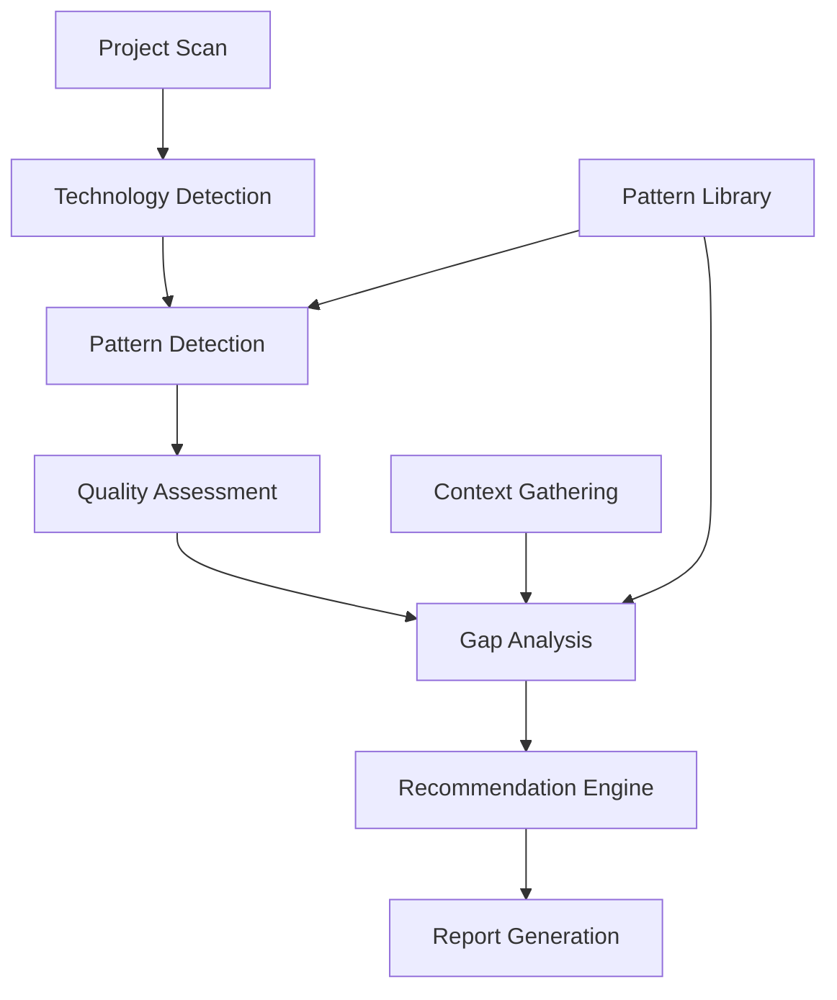

# Project Analysis Engine

## Purpose

The Project Analysis Engine is the core system that powers the `/wizard analyze` command. It comprehensively scans projects to detect existing technologies, patterns, and implementation quality, then performs gap analysis to identify improvement opportunities.

## System Architecture

### Analysis Pipeline



### Core Components

1. **Project Scanner** - File system analysis and inventory
2. **Technology Detector** - Framework, library, and tool identification
3. **Pattern Matcher** - Existing pattern implementation detection
4. **Quality Assessor** - Implementation completeness and quality evaluation
5. **Gap Analyzer** - Missing pattern and improvement identification
6. **Context Gatherer** - Interactive context collection
7. **Report Generator** - Comprehensive analysis report creation

## Implementation

### Project Scanner

```bash
#!/bin/bash
# scripts/scan-project.sh

echo "🔍 Scanning project structure and inventory..."

# Create analysis directory
mkdir -p .contextwarts/analysis
cd .contextwarts/analysis

# Generate project inventory
cat > project-inventory.json << EOF
{
  "scan_timestamp": "$(date -u +%Y-%m-%dT%H:%M:%SZ)",
  "project_root": "$(pwd | sed 's|/.contextwarts/analysis||')",
  "structure": $(find ../.. -type f -name "*" | grep -v node_modules | grep -v .git | head -200 | jq -R . | jq -s .),
  "file_counts": {
    "total_files": $(find ../.. -type f | grep -v node_modules | grep -v .git | wc -l),
    "source_files": $(find ../.. -name "*.js" -o -name "*.ts" -o -name "*.jsx" -o -name "*.tsx" -o -name "*.py" -o -name "*.java" -o -name "*.cs" -o -name "*.go" | grep -v node_modules | wc -l),
    "config_files": $(find ../.. -name "*.json" -o -name "*.yaml" -o -name "*.yml" -o -name "*.toml" -o -name "*.ini" | grep -v node_modules | wc -l),
    "documentation": $(find ../.. -name "*.md" -o -name "*.rst" -o -name "*.txt" | grep -v node_modules | wc -l)
  },
  "directory_structure": $(find ../.. -type d | grep -v node_modules | grep -v .git | head -50 | jq -R . | jq -s .)
}
EOF

echo "✅ Project inventory complete"
```

### Technology Detection Engine

```javascript
// scripts/detect-technologies.js
const fs = require('fs');
const path = require('path');

class TechnologyDetector {
    constructor(projectRoot) {
        this.projectRoot = projectRoot;
        this.detectedTechnologies = new Map();
        this.confidence = new Map();
    }
    
    async analyzeProject() {
        console.log('🔍 Detecting technologies...');
        
        // Analyze package files
        await this.analyzePackageFiles();
        
        // Analyze configuration files
        await this.analyzeConfigFiles();
        
        // Analyze source code patterns
        await this.analyzeSourceCode();
        
        // Analyze infrastructure files
        await this.analyzeInfrastructure();
        
        return this.generateTechnologyReport();
    }
    
    async analyzePackageFiles() {
        // JavaScript/Node.js detection
        if (fs.existsSync(path.join(this.projectRoot, 'package.json'))) {
            const packageJson = JSON.parse(fs.readFileSync(path.join(this.projectRoot, 'package.json'), 'utf8'));
            
            this.detectTechnology('node', 'Node.js', 0.9);
            
            // Frontend frameworks
            if (packageJson.dependencies?.react || packageJson.devDependencies?.react) {
                this.detectTechnology('react', 'React', 0.9);
                
                if (packageJson.dependencies?.['next'] || packageJson.devDependencies?.['next']) {
                    this.detectTechnology('nextjs', 'Next.js', 0.95);
                }
            }
            
            if (packageJson.dependencies?.vue || packageJson.devDependencies?.vue) {
                this.detectTechnology('vue', 'Vue.js', 0.9);
                
                if (packageJson.dependencies?.nuxt || packageJson.devDependencies?.nuxt) {
                    this.detectTechnology('nuxtjs', 'Nuxt.js', 0.95);
                }
            }
            
            if (packageJson.dependencies?.['@angular/core'] || packageJson.devDependencies?.['@angular/core']) {
                this.detectTechnology('angular', 'Angular', 0.9);
            }
            
            // Build tools
            if (packageJson.devDependencies?.vite) {
                this.detectTechnology('vite', 'Vite', 0.8);
            }
            if (packageJson.devDependencies?.webpack) {
                this.detectTechnology('webpack', 'Webpack', 0.8);
            }
            
            // Backend frameworks
            if (packageJson.dependencies?.express) {
                this.detectTechnology('express', 'Express.js', 0.9);
            }
            if (packageJson.dependencies?.fastify) {
                this.detectTechnology('fastify', 'Fastify', 0.9);
            }
            
            // Databases
            if (packageJson.dependencies?.mongoose) {
                this.detectTechnology('mongodb', 'MongoDB', 0.8);
            }
            if (packageJson.dependencies?.pg || packageJson.dependencies?.['node-postgres']) {
                this.detectTechnology('postgresql', 'PostgreSQL', 0.8);
            }
            if (packageJson.dependencies?.mysql2 || packageJson.dependencies?.mysql) {
                this.detectTechnology('mysql', 'MySQL', 0.8);
            }
            
            // TypeScript
            if (packageJson.dependencies?.typescript || packageJson.devDependencies?.typescript) {
                this.detectTechnology('typescript', 'TypeScript', 0.9);
            }
            
            // Testing frameworks
            if (packageJson.devDependencies?.jest) {
                this.detectTechnology('jest', 'Jest', 0.8);
            }
            if (packageJson.devDependencies?.mocha) {
                this.detectTechnology('mocha', 'Mocha', 0.8);
            }
            
            // PWA indicators
            if (packageJson.dependencies?.['vite-plugin-pwa'] || packageJson.devDependencies?.['workbox-webpack-plugin']) {
                this.detectTechnology('pwa', 'Progressive Web App', 0.7);
            }
        }
        
        // Python detection
        if (fs.existsSync(path.join(this.projectRoot, 'requirements.txt')) || 
            fs.existsSync(path.join(this.projectRoot, 'pyproject.toml'))) {
            
            this.detectTechnology('python', 'Python', 0.9);
            
            // Read requirements files
            const reqFiles = ['requirements.txt', 'pyproject.toml', 'setup.py'];
            let pythonDeps = '';
            
            for (const file of reqFiles) {
                const filePath = path.join(this.projectRoot, file);
                if (fs.existsSync(filePath)) {
                    pythonDeps += fs.readFileSync(filePath, 'utf8');
                }
            }
            
            // Python frameworks
            if (pythonDeps.includes('django')) {
                this.detectTechnology('django', 'Django', 0.9);
            }
            if (pythonDeps.includes('flask')) {
                this.detectTechnology('flask', 'Flask', 0.9);
            }
            if (pythonDeps.includes('fastapi')) {
                this.detectTechnology('fastapi', 'FastAPI', 0.9);
            }
            
            // Testing
            if (pythonDeps.includes('pytest')) {
                this.detectTechnology('pytest', 'Pytest', 0.8);
            }
        }
        
        // .NET detection
        if (fs.existsSync(path.join(this.projectRoot, '*.csproj')) || 
            fs.readdirSync(this.projectRoot).some(f => f.endsWith('.csproj'))) {
            
            this.detectTechnology('dotnet', '.NET', 0.9);
            
            // Find .csproj files
            const csprojFiles = fs.readdirSync(this.projectRoot).filter(f => f.endsWith('.csproj'));
            for (const csprojFile of csprojFiles) {
                const content = fs.readFileSync(path.join(this.projectRoot, csprojFile), 'utf8');
                
                if (content.includes('Microsoft.AspNetCore')) {
                    this.detectTechnology('aspnet', 'ASP.NET Core', 0.9);
                }
                if (content.includes('Microsoft.EntityFrameworkCore')) {
                    this.detectTechnology('entityframework', 'Entity Framework', 0.8);
                }
            }
        }
    }
    
    async analyzeConfigFiles() {
        // Docker detection
        if (fs.existsSync(path.join(this.projectRoot, 'Dockerfile'))) {
            this.detectTechnology('docker', 'Docker', 0.9);
        }
        
        if (fs.existsSync(path.join(this.projectRoot, 'docker-compose.yml')) || 
            fs.existsSync(path.join(this.projectRoot, 'docker-compose.yaml'))) {
            this.detectTechnology('docker-compose', 'Docker Compose', 0.9);
        }
        
        // Kubernetes detection
        const k8sFiles = ['*.yaml', '*.yml'].flatMap(pattern => 
            fs.readdirSync(this.projectRoot).filter(f => f.includes('k8s') || f.includes('kubernetes'))
        );
        if (k8sFiles.length > 0) {
            this.detectTechnology('kubernetes', 'Kubernetes', 0.8);
        }
        
        // CI/CD detection
        if (fs.existsSync(path.join(this.projectRoot, '.github/workflows'))) {
            this.detectTechnology('github-actions', 'GitHub Actions', 0.9);
        }
        
        if (fs.existsSync(path.join(this.projectRoot, '.gitlab-ci.yml'))) {
            this.detectTechnology('gitlab-ci', 'GitLab CI', 0.9);
        }
        
        // Configuration management
        if (fs.existsSync(path.join(this.projectRoot, 'ansible'))) {
            this.detectTechnology('ansible', 'Ansible', 0.8);
        }
        
        if (fs.existsSync(path.join(this.projectRoot, 'terraform'))) {
            this.detectTechnology('terraform', 'Terraform', 0.8);
        }
    }
    
    async analyzeSourceCode() {
        // Analyze source code patterns for architecture detection
        const sourceFiles = this.findSourceFiles();
        
        for (const file of sourceFiles.slice(0, 50)) { // Limit for performance
            const content = fs.readFileSync(file, 'utf8');
            
            // Authentication patterns
            if (content.includes('passport') || content.includes('jwt') || content.includes('auth')) {
                this.detectTechnology('authentication', 'Authentication System', 0.6);
            }
            
            // Database patterns
            if (content.includes('SELECT') || content.includes('INSERT') || content.includes('UPDATE')) {
                this.detectTechnology('sql-database', 'SQL Database', 0.5);
            }
            
            // API patterns
            if (content.includes('/api/') || content.includes('ApiController') || content.includes('@app.route')) {
                this.detectTechnology('rest-api', 'REST API', 0.6);
            }
            
            // GraphQL
            if (content.includes('graphql') || content.includes('apollo') || content.includes('Query')) {
                this.detectTechnology('graphql', 'GraphQL', 0.7);
            }
        }
    }
    
    async analyzeInfrastructure() {
        // Web server configuration
        const webServerConfigs = ['nginx.conf', 'apache.conf', '.htaccess'];
        for (const config of webServerConfigs) {
            if (fs.existsSync(path.join(this.projectRoot, config))) {
                const serverType = config.includes('nginx') ? 'nginx' : 'apache';
                this.detectTechnology(serverType, serverType.toUpperCase(), 0.8);
            }
        }
        
        // Database configuration
        const dbConfigs = ['my.cnf', 'postgresql.conf', 'redis.conf'];
        for (const config of dbConfigs) {
            if (fs.existsSync(path.join(this.projectRoot, config))) {
                const dbType = config.split('.')[0];
                this.detectTechnology(dbType, dbType.charAt(0).toUpperCase() + dbType.slice(1), 0.8);
            }
        }
    }
    
    findSourceFiles() {
        const extensions = ['.js', '.jsx', '.ts', '.tsx', '.py', '.java', '.cs', '.go', '.php'];
        const sourceFiles = [];
        
        const scanDir = (dirPath) => {
            if (dirPath.includes('node_modules') || dirPath.includes('.git')) return;
            
            try {
                const files = fs.readdirSync(dirPath);
                for (const file of files) {
                    const filePath = path.join(dirPath, file);
                    const stat = fs.statSync(filePath);
                    
                    if (stat.isDirectory()) {
                        scanDir(filePath);
                    } else if (extensions.some(ext => file.endsWith(ext))) {
                        sourceFiles.push(filePath);
                    }
                }
            } catch (error) {
                // Skip inaccessible directories
            }
        };
        
        scanDir(this.projectRoot);
        return sourceFiles;
    }
    
    detectTechnology(id, name, confidenceScore) {
        if (!this.detectedTechnologies.has(id) || this.confidence.get(id) < confidenceScore) {
            this.detectedTechnologies.set(id, name);
            this.confidence.set(id, confidenceScore);
        }
    }
    
    generateTechnologyReport() {
        const technologies = [];
        
        for (const [id, name] of this.detectedTechnologies.entries()) {
            technologies.push({
                id,
                name,
                confidence: this.confidence.get(id),
                category: this.categorizeTechnology(id)
            });
        }
        
        // Sort by confidence
        technologies.sort((a, b) => b.confidence - a.confidence);
        
        return {
            scan_timestamp: new Date().toISOString(),
            total_technologies: technologies.length,
            high_confidence: technologies.filter(t => t.confidence >= 0.8).length,
            technologies
        };
    }
    
    categorizeTechnology(id) {
        const categories = {
            frontend: ['react', 'vue', 'angular', 'nextjs', 'nuxtjs'],
            backend: ['node', 'express', 'fastify', 'django', 'flask', 'fastapi', 'aspnet'],
            database: ['mongodb', 'postgresql', 'mysql', 'sql-database'],
            build: ['vite', 'webpack'],
            testing: ['jest', 'mocha', 'pytest'],
            infrastructure: ['docker', 'docker-compose', 'kubernetes', 'nginx', 'apache'],
            cicd: ['github-actions', 'gitlab-ci'],
            language: ['typescript', 'python', 'dotnet'],
            authentication: ['authentication'],
            api: ['rest-api', 'graphql']
        };
        
        for (const [category, techs] of Object.entries(categories)) {
            if (techs.includes(id)) {
                return category;
            }
        }
        
        return 'other';
    }
}

module.exports = TechnologyDetector;

// CLI usage
if (require.main === module) {
    const detector = new TechnologyDetector(process.cwd());
    detector.analyzeProject().then(report => {
        fs.writeFileSync('.contextwarts/analysis/technology-report.json', JSON.stringify(report, null, 2));
        console.log('✅ Technology detection complete');
        console.log(`📊 Found ${report.total_technologies} technologies (${report.high_confidence} high confidence)`);
    });
}
```

### Pattern Detection Engine

```javascript
// scripts/detect-patterns.js
const fs = require('fs');
const path = require('path');
const TechnologyDetector = require('./detect-technologies');

class PatternDetector {
    constructor(projectRoot) {
        this.projectRoot = projectRoot;
        this.technologyReport = null;
        this.detectedPatterns = new Map();
        this.patternCompleteness = new Map();
    }
    
    async analyzePatterns() {
        console.log('🎯 Detecting existing patterns...');
        
        // Load technology report first
        const techDetector = new TechnologyDetector(this.projectRoot);
        this.technologyReport = await techDetector.analyzeProject();
        
        // Detect patterns based on technologies and file structure
        await this.detectTechnologyPatterns();
        await this.detectArchitecturePatterns();
        await this.detectSecurityPatterns();
        await this.detectInfrastructurePatterns();
        await this.detectMethodologyPatterns();
        
        return this.generatePatternReport();
    }
    
    async detectTechnologyPatterns() {
        const technologies = this.technologyReport.technologies;
        
        // Modern Web Stack pattern
        if (this.hasTechnologies(['react', 'typescript', 'vite']) || 
            this.hasTechnologies(['react', 'typescript', 'nextjs'])) {
            this.detectPattern('modern-web-stack', 'Modern Web Stack', 0.9, {
                components: ['React', 'TypeScript', 'Modern Build Tools'],
                completeness: this.assessModernWebStackCompleteness()
            });
        }
        
        // Progressive Web App pattern
        if (this.hasTechnologies(['pwa']) || this.hasFiles(['manifest.json', 'sw.js'])) {
            this.detectPattern('progressive-web-app', 'Progressive Web App', 0.8, {
                components: ['Service Worker', 'Web App Manifest'],
                completeness: this.assessPWACompleteness()
            });
        }
        
        // API patterns
        if (this.hasTechnologies(['rest-api', 'express', 'fastapi', 'aspnet'])) {
            this.detectPattern('rest-api-pattern', 'REST API', 0.8, {
                components: ['API Framework', 'Route Handlers'],
                completeness: this.assessAPICompleteness()
            });
        }
        
        if (this.hasTechnologies(['graphql'])) {
            this.detectPattern('graphql-api', 'GraphQL API', 0.8, {
                components: ['GraphQL Schema', 'Resolvers'],
                completeness: this.assessGraphQLCompleteness()
            });
        }
    }
    
    async detectArchitecturePatterns() {
        const structure = await this.analyzeProjectStructure();
        
        // Monolith pattern
        if (structure.isMonolithStructure) {
            this.detectPattern('monolith-first', 'Monolith First', 0.8, {
                components: ['Single Deployment Unit', 'Shared Database'],
                completeness: 0.8
            });
        }
        
        // Microservices pattern
        if (structure.hasMicroservicesIndicators) {
            this.detectPattern('microservices-architecture', 'Microservices Architecture', 0.7, {
                components: ['Service Boundaries', 'Independent Deployments'],
                completeness: this.assessMicroservicesCompleteness(structure)
            });
        }
        
        // Serverless pattern
        if (this.hasFiles(['serverless.yml', 'netlify.toml']) || 
            this.hasTechnologies(['vercel', 'netlify'])) {
            this.detectPattern('serverless-native', 'Serverless Native', 0.8, {
                components: ['Function-based Architecture'],
                completeness: 0.7
            });
        }
    }
    
    async detectSecurityPatterns() {
        // Authentication patterns
        if (this.hasTechnologies(['authentication'])) {
            const authComplexity = this.assessAuthenticationComplexity();
            
            if (authComplexity.hasAdvancedFeatures) {
                this.detectPattern('advanced-authentication', 'Advanced Authentication', 0.8, {
                    components: authComplexity.components,
                    completeness: authComplexity.completeness
                });
            } else {
                this.detectPattern('basic-authentication', 'Basic Authentication', 0.7, {
                    components: ['Password Authentication'],
                    completeness: 0.6
                });
            }
        }
        
        // HTTPS detection
        if (this.hasConfigPattern('https') || this.hasFiles(['ssl/', 'certs/'])) {
            this.detectPattern('https-security', 'HTTPS Security', 0.8, {
                components: ['SSL/TLS Configuration'],
                completeness: 0.8
            });
        }
        
        // Rate limiting
        if (this.hasCodePattern('rate.limit|throttle')) {
            this.detectPattern('api-rate-limiting', 'API Rate Limiting', 0.7, {
                components: ['Rate Limiting Middleware'],
                completeness: 0.7
            });
        }
    }
    
    async detectInfrastructurePatterns() {
        // Container patterns
        if (this.hasTechnologies(['docker'])) {
            this.detectPattern('container-first-deployment', 'Container First Deployment', 0.9, {
                components: ['Docker Configuration'],
                completeness: this.assessContainerCompleteness()
            });
        }
        
        // Orchestration
        if (this.hasTechnologies(['kubernetes', 'docker-compose'])) {
            this.detectPattern('container-orchestration', 'Container Orchestration', 0.8, {
                components: ['Service Orchestration'],
                completeness: 0.8
            });
        }
        
        // Reverse proxy
        if (this.hasTechnologies(['nginx']) && this.hasConfigPattern('proxy_pass|upstream')) {
            this.detectPattern('reverse-proxy-load-balancer', 'Reverse Proxy Load Balancer', 0.8, {
                components: ['Load Balancing', 'Reverse Proxy'],
                completeness: 0.8
            });
        }
        
        // CI/CD
        if (this.hasTechnologies(['github-actions', 'gitlab-ci'])) {
            this.detectPattern('ci-cd-automation', 'CI/CD Automation', 0.8, {
                components: ['Automated Testing', 'Deployment Pipeline'],
                completeness: this.assessCICDCompleteness()
            });
        }
    }
    
    async detectMethodologyPatterns() {
        // Test-driven development
        const testCoverage = this.assessTestCoverage();
        if (testCoverage.hasTesting && testCoverage.coverage > 60) {
            this.detectPattern('test-driven-development', 'Test-Driven Development', 0.7, {
                components: ['Test Framework', 'High Coverage'],
                completeness: testCoverage.completeness
            });
        }
        
        // Quality automation
        if (this.hasFiles(['.eslintrc', '.prettierrc', '.pre-commit-config.yaml'])) {
            this.detectPattern('development-quality-automation', 'Development Quality Automation', 0.8, {
                components: ['Linting', 'Formatting', 'Pre-commit Hooks'],
                completeness: this.assessQualityAutomationCompleteness()
            });
        }
    }
    
    // Assessment methods
    assessModernWebStackCompleteness() {
        let score = 0;
        let total = 5;
        
        if (this.hasTechnologies(['react'])) score++;
        if (this.hasTechnologies(['typescript'])) score++;
        if (this.hasTechnologies(['vite', 'webpack'])) score++;
        if (this.hasFiles(['tsconfig.json'])) score++;
        if (this.hasFiles(['package.json'])) score++;
        
        return score / total;
    }
    
    assessPWACompleteness() {
        let score = 0;
        let total = 4;
        
        if (this.hasFiles(['manifest.json'])) score++;
        if (this.hasFiles(['sw.js', 'service-worker.js'])) score++;
        if (this.hasCodePattern('serviceWorker.register')) score++;
        if (this.hasCodePattern('Cache|caches.open')) score++;
        
        return score / total;
    }
    
    assessAuthenticationComplexity() {
        const components = [];
        let hasAdvanced = false;
        let score = 0;
        let total = 6;
        
        if (this.hasCodePattern('passport|jwt|oauth')) {
            components.push('Token-based Auth');
            hasAdvanced = true;
            score++;
        }
        
        if (this.hasCodePattern('2fa|mfa|totp')) {
            components.push('Multi-factor Auth');
            hasAdvanced = true;
            score++;
        }
        
        if (this.hasCodePattern('webauthn|fido2')) {
            components.push('WebAuthn/FIDO2');
            hasAdvanced = true;
            score++;
        }
        
        if (this.hasCodePattern('oauth|sso')) {
            components.push('SSO Integration');
            hasAdvanced = true;
            score++;
        }
        
        if (this.hasCodePattern('bcrypt|scrypt|argon2')) {
            components.push('Secure Password Hashing');
            score++;
        }
        
        if (this.hasCodePattern('session|cookie')) {
            components.push('Session Management');
            score++;
        }
        
        return {
            hasAdvancedFeatures: hasAdvanced,
            components,
            completeness: score / total
        };
    }
    
    assessTestCoverage() {
        const hasJest = this.hasTechnologies(['jest']);
        const hasMocha = this.hasTechnologies(['mocha']);
        const hasPytest = this.hasTechnologies(['pytest']);
        const hasTesting = hasJest || hasMocha || hasPytest;
        
        let coverage = 0;
        let completeness = 0;
        
        if (hasTesting) {
            // Estimate coverage based on test file ratio
            const testFiles = this.countFiles('*.test.*|*_test.*|test_*');
            const sourceFiles = this.countFiles('*.js|*.ts|*.py');
            
            if (sourceFiles > 0) {
                coverage = (testFiles / sourceFiles) * 100;
                completeness = Math.min(coverage / 80, 1); // 80% coverage target
            }
        }
        
        return {
            hasTesting,
            coverage,
            completeness
        };
    }
    
    // Utility methods
    hasTechnologies(techIds) {
        const detectedIds = this.technologyReport.technologies.map(t => t.id);
        return techIds.some(id => detectedIds.includes(id));
    }
    
    hasFiles(filenames) {
        return filenames.some(filename => {
            if (filename.includes('*')) {
                // Glob pattern
                return this.findFiles(filename).length > 0;
            } else {
                return fs.existsSync(path.join(this.projectRoot, filename));
            }
        });
    }
    
    hasCodePattern(pattern) {
        const sourceFiles = this.findSourceFiles().slice(0, 20); // Limit for performance
        const regex = new RegExp(pattern, 'i');
        
        return sourceFiles.some(file => {
            try {
                const content = fs.readFileSync(file, 'utf8');
                return regex.test(content);
            } catch {
                return false;
            }
        });
    }
    
    hasConfigPattern(pattern) {
        const configFiles = this.findFiles('*.conf|*.config|*.json|*.yml|*.yaml');
        const regex = new RegExp(pattern, 'i');
        
        return configFiles.some(file => {
            try {
                const content = fs.readFileSync(file, 'utf8');
                return regex.test(content);
            } catch {
                return false;
            }
        });
    }
    
    detectPattern(id, name, confidence, details) {
        this.detectedPatterns.set(id, {
            id,
            name,
            confidence,
            ...details
        });
    }
    
    generatePatternReport() {
        const patterns = Array.from(this.detectedPatterns.values());
        
        return {
            scan_timestamp: new Date().toISOString(),
            total_patterns: patterns.length,
            high_confidence: patterns.filter(p => p.confidence >= 0.8).length,
            patterns: patterns.sort((a, b) => b.confidence - a.confidence)
        };
    }
}

module.exports = PatternDetector;
```

This is the foundation of the comprehensive analysis system. Would you like me to continue with the gap analysis engine and report generation components?